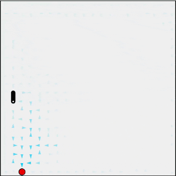
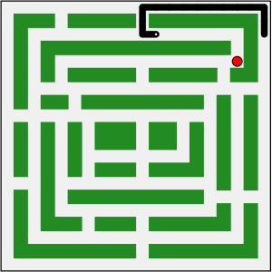

# Snake
 
This project uses Q-Learning, Hamiltonian Cycles (2016, [Alhalabi et al](https://springerplus.springeropen.com/articles/10.1186/s40064-016-2746-8)) and Breadth First Search to play Snake.

The app can be found here: https://immodal.github.io/snake/

  

Figure 1: Hamiltonian Cycle

  

Figure 2: Q-Learning with policy arrows enabled

  

Figure 3: Snake navigating custom maze

